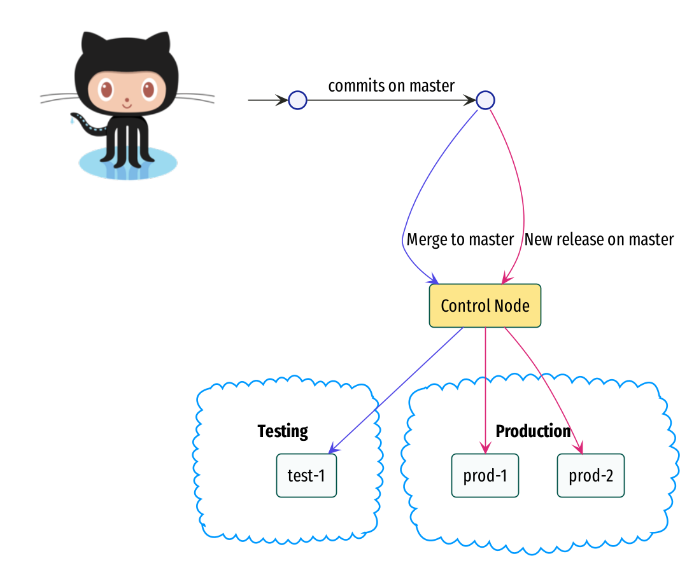

# Cnops

**Orchestrator tool for**

- https://github.com/kansi/hello
- https://github.com/kansi/hello_go

### Start

Clone the repository and optionally tweek the `.envrc`,

```elixir
iex -S mix
```

### What does this tool do?

This tool implements the following CD workflow,




- Monitors `hello` and `hello_go` repos and deploys the latest `master` branch to testing

- Monitor `hello` repository and deploys the latest releases to `production` (`prod-1` and `prod-2`)
